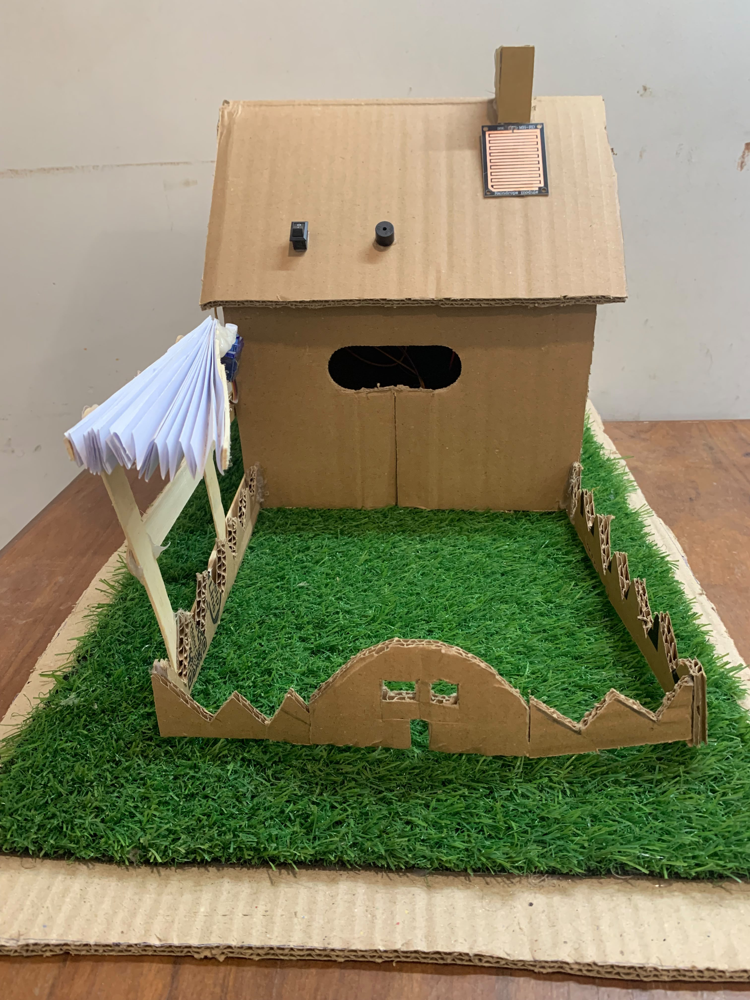
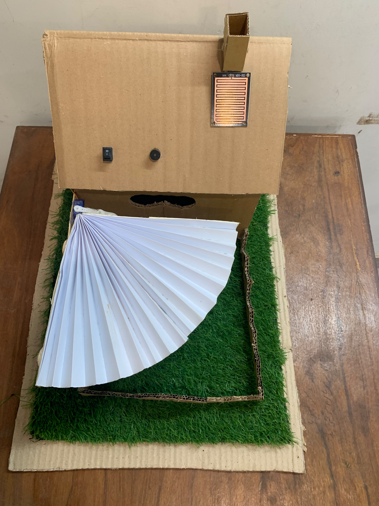
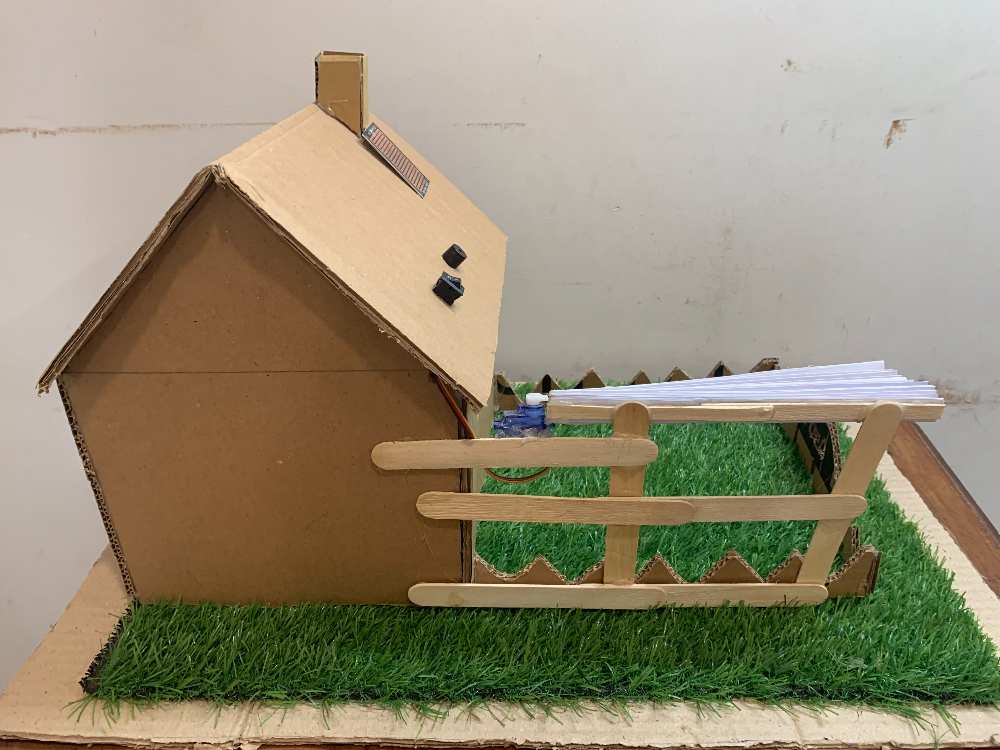
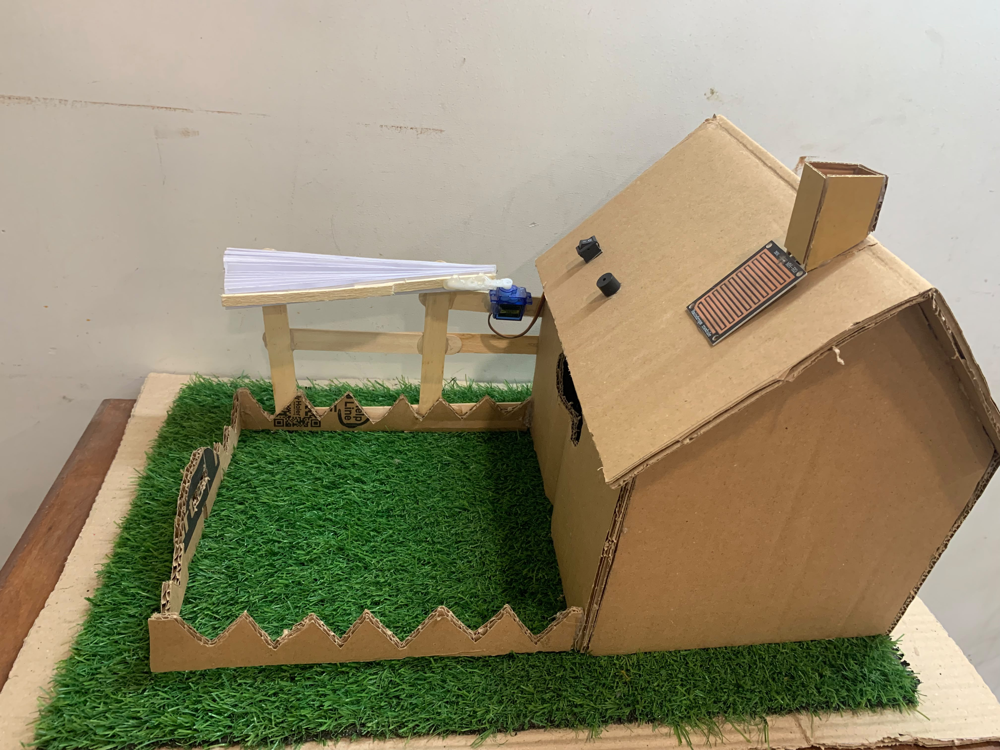

# 🌧️ Rain Detection & Automatic Roof Controller

> A small working prototype that opens the roof when rain is detected and gives the user an alert.

## 📸 What is this project?

This project was developed as a **Digital Logic Design semester project**.

The idea is simple: instead of having to rush outside when it starts raining, why not let the roof detect the rain and react on its own?

The prototype uses a **rain sensor, Arduino, servo motor, buzzer, and manual switch**. The physical structure and mechanical linkage were also built to turn the control logic into actual movement.

## ⚙️ How It Works

The system is designed around a simple idea.

When the rain sensor detects water, the Arduino recognizes the change and tells the servo to **open the roof**. At the same time, the buzzer provides an alert so the user knows that rain has been detected.

There is also a **manual switch** for situations where automatic control isn't enough. For example, on a sunny day, the roof can be opened manually to let in some sunlight or ventilation.

So the project combines three things:

- 🌧️ Automatic rain detection
- 🔔 Rain alert through a buzzer
- 🔘 Manual control when needed

## 🔧 Components

- Arduino
- Rain Sensor Module
- Servo Motor
- Buzzer
- Manual Switch
- Jumper Wires
- Cardboard / structural material
- Wooden sticks for the mechanical linkage
- Paper roof structure

## 🧠 Digital Logic & FSM

Since this is a Digital Logic Design project, the control system is based on different input conditions and states.

**Finite State Machine (FSM)** concepts were used to think about how the roof should respond to different inputs, including rain detection and manual control.

The basic idea is:

**Input → Decision → Roof Movement**

This connects the logic learned in DLD with a physical system that can actually sense and respond to its surroundings.

## 🏗️ Building the Model

The physical model was built using simple materials and a custom mechanical linkage.

Getting the servo to move the roof was only part of the challenge. The linkage and structure also had to be adjusted so that the roof could move properly.

This was one of the most interesting parts of the project because the electronic logic and the physical mechanism had to work together.

## 📷 Project Gallery

### Roof Closed

### Roof Open

### Project — Left Side

### Project — Right Side

## ⏱️ From Idea to Prototype

A short time-lapse also shows part of the process of building the physical model and putting the different components together.

**Build time-lapse:** Coming soon

## 💡 What I Learned

This project was a good opportunity to move beyond designing logic on paper and actually connect it to a physical system.

It involved working with sensors, control logic, servo movement, wiring, and the mechanical structure at the same time.

One of the biggest lessons was that getting the electronics and code working is only part of the job. The physical mechanism also needs testing and adjustment before everything works together properly.

## 🚀 Future Improvements

A future version could be improved with:

- IoT connectivity
- Remote monitoring
- Mobile control
- Weather-based automation
- A stronger and more realistic roof mechanism
---
